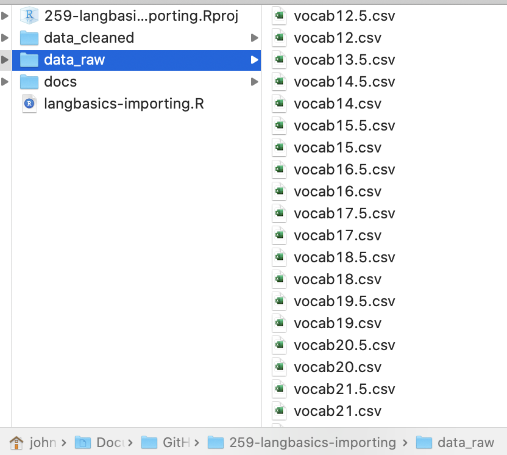

```{r xaringanExtra, echo=FALSE}
xaringanExtra::use_xaringan_extra(c("tile_view","broadcast"))
```

```{r xaringan-themer, include=FALSE, warning=FALSE}
# Set up custom theme
library(xaringanthemer)
style_mono_accent(
  base_color = "#1c5253",
  header_font_google = google_font("Josefin Sans"),
  text_font_google   = google_font("Montserrat", "300", "300i"),
  code_font_google   = google_font("Fira Mono"),
  base_font_size = "20px",
  text_font_size = "1.5rem",
  header_h1_font_size = "3rem",
  header_h2_font_size = "2.5rem",
  header_h3_font_size = "2rem",
)
```

```{r, include = F}
# This is the recommended set up for flipbooks
# you might think about setting cache to TRUE as you gain practice --- building flipbooks from scratch can be time consuming
knitr::opts_chunk$set(fig.width = 6, message = FALSE, warning = FALSE, comment = "", cache = F)
library(flipbookr)
library(tidyverse)
#devtools::install_github("gadenbuie/xaringanExtra")
#remotes::install_github("mitchelloharawild/icons")
library(icons) #https://fontawesome.com/v5.15/icons?d=gallery&p=2&m=free
```


# R language basics

- Calculation and assignment 

- Calling functions 

- Importing data in tibbles 
 
- Extending the R language with packages 

.content-box-blue[
`r icons::fontawesome("github")` Follow along from the [Github repo](https://github.com/psych-259-data-science-2022/259-langbasics-importing)
]

  .footnote[.bold[Last updated: `r Sys.Date()`]]
---

`r chunk_reveal("calc_vs_assign", break_type = "auto", widths = c(4, 1))`

```{r calc_vs_assign, include = FALSE}
# R can run simple calculations
1 + 1 
4^2

# Calculations aren't useful unless we put the results somewhere 
# The assignment operator stores the result into a variable

two <- 1 + 1
two

# Once assigned, variables can be modified by re-assigning a new value to them

two <- 1 + 3
two

# Variables can be removed from the workspace with rm
# After removing two, calling it again would lead to an error 
rm(two)

# Variables can be reused in expressions to calculate new variables/outputs
var1 <- 5
var2 <- 10
var3 <- var1 + var2

# When assigning variables, nothing prints to the console 
# Let's use the function print
print(var3)
```
---

`r chunk_reveal("functions", break_type = "auto", widths = c(4, 1))`

```{r functions, include = FALSE}
# Print and rm are functions that we use in R 
# We call functions by writing their name followed   
# by a list of arguments in parentheses

abs(-1)
mean(var1, var2)
sum(var1, var2, var3)

# c is a function that combines values together
my_vars <- c(var1, var2, var3)
my_vars

# RStudio has built-in help for every function
?c

# Functions can also be used to import data
ds <- read.csv('data_raw/vocab16.csv')
print(ds)

# read.csv is part of base R, the default fx set
# When we want to use functions to expand R, we
# need to use library fx to load packages

library(readr) #for read_csv
ds <- read_csv('data_raw/vocab16.csv')
```
---

# read_csv versus read.csv 

.pull-left[
- read.csv is base R, read_csv is tidyverse

- read_csv is faster

- read_csv makes fewer assumptions about your data

- read_csv can combine multiple data files into one
]

.pull-right[
The following examples use .csv (comma separated value) files in the data_raw directory

]
---

`r chunk_reveal("import_sequential", break_type = "auto", widths = c(2, 1))`

```{r import_sequential, include = FALSE}
# We can use read_csv to read individual files
ds12 <- read_csv('data_raw/vocab12.csv')
print(ds12)

ds12.5 <- read_csv('data_raw/vocab12.5.csv')
print(ds12.5)

ds13.5 <- read_csv('data_raw/vocab13.5.csv')
print(ds13.5)

# bind_rows can append tibbles together
ds_all <- bind_rows(ds12, ds12.5, ds13.5)
print(ds_all)
```

---
# But imagine having to read in every file in the list

.scroll-box-16[
```{r R.options = list(width = 75)}
#function for listing files a directory
list.files('data_raw', full.names = TRUE) 
```
]
---

`r chunk_reveal("import_multiple", break_type = "auto", float = "none", widths = c(5, 1))`

```{r import_multiple, include = FALSE}
# read_csv can read a list of files!

# Make a variable containing the list of data files
full_file_names <- list.files('data_raw', full.names = TRUE)

# Pass the list to read_csv to read all of them into a single tibble
ds_all <- read_csv(full_file_names)
print(ds_all)
```
---

# Why did we need full.names? 
.pull-left[
- `list.files('data_raw')` gives `vocab12.csv`, `vocab12.5.csv`...which aren't in the working directory

- `list.files('data_raw', full.names = TRUE)` gives the relative path including the directory:

`/data_raw/vocab12.csv`, `/data_raw/vocab12.5.csv`
]

.pull-right[

]
---

# What's a tibble? 

- Tibbles are the tidyverse equivalent of base R data frames. 

- A tibble/data frame is a rectangular data spreadsheet, with columns of variables and rows of observations

- Tibbles/data frames will always appear in the "Data" section of the RStudio environment

- If you click on the blue "play" button on a tibble in your RStudio environment, you can view a tibble

- Unlike in Excel, you cannot edit the values. This is a feature, not a bug!

- `ds$variable` lets you access one variable of a data set

---

`r chunk_reveal("tibble", break_type = "auto", widths = c(1.5, 1))`

```{r tibble, include = FALSE}
# Find the minimum and maximum ages
min(ds_all$age)
max(ds_all$age)

# Create a new column in a dataset
ds_all$ppt_name <- "Jonah"

# Create a calculated column
ds_all$age_round <- round(ds_all$age)

# See the results
print(ds_all)

# Let's write the combined data to disk
write_csv(ds_all, file = "data_cleaned/vocab_combined.csv")
```

---

# Useful readr capabilities

- read_csv(), read_tsv(), read_delim() are tailored to different inputs (also write_csv(), write_tsv(), write_delim() for saving data)

- Important read_*() arguments are:
  * `col_names = TRUE` (reads column names from first line by default)
  * `col_names = FALSE` (treats the first line as data)
  * `col_names = c("col1name", "col2name")` (to specify the names)
  * `col_types = NULL` (by default, guesses the data type)
  * `col_types = "ccDin"` (specify types character/date/integer/number)
  * `skip = 10` (skip the first 10 lines)

---

`r chunk_reveal("read_options", break_type = "rotate", float = "none", widths = c(5, 1))`

```{r read_options, include = FALSE}
fname <- "data_cleaned/vocab_combined.csv"
colname <- c("AGE", "WORD", "NAME", "MONTH")
coltypes <- "cccc"
ds <- read_csv(file = fname) #ROTATE
ds <- read_csv(file = fname, col_names = FALSE) #ROTATE
ds <- read_csv(file = fname, col_names = colname) #ROTATE
ds <- read_csv(file = fname, col_names = colname, skip = 1) #ROTATE
ds <- read_csv(file = fname, col_names = colname, col_types = coltypes, skip = 1) #ROTATE
print(ds)
```

---
# More options

- tidyverse data import "cheatsheets"

- Read the documentation: `?read_csv`, `?write_csv`

- specialized import packages
  * `haven` for SPSS/Stata/SAS
  * `readxl` for .xlsx
  * `googlesheets4` for Google sheets

---
class: center, middle
background-image: url("readr-cheatsheet1.png")
background-size: contain

---
class: center, middle
background-image: url("readr-cheatsheet2.png")
background-size: contain

<!-- adjust font size in this css code chunk, currently 80 -->

```{css, eval = TRUE, echo = FALSE}
.remark-code{line-height: 1.5; font-size: 70%}

@media print {
  .has-continuation {
    display: block;
  }
}

code.r.hljs.remark-code{
  position: relative;
  overflow-x: hidden;
}

.remark-slide-number {
  opacity: 0; /* default: 0.5 */
}

.content-box { 
    box-sizing: border-box;
    background-color: #e2e2e2;
}
.content-box-blue,
.content-box-gray,
.content-box-grey,
.content-box-army,
.content-box-green,
.content-box-purple,
.content-box-red,
.content-box-yellow {
  box-sizing: border-box;
  border-radius: 15px;
  margin: 0 0 15px;
  overflow: hidden;
  padding: 0px 20px 0px 20px;
  width: 100%;
}
.content-box-blue { background-color: #F0F8FF; }
.content-box-gray { background-color: #e2e2e2; }
.content-box-grey {	background-color: #F5F5F5; }
.content-box-army {	background-color: #737a36; }
.content-box-green { background-color: #d9edc2; }
.content-box-purple { background-color: #e2e2f9; }
.content-box-red { background-color: #ffcccc; }
.content-box-yellow { background-color: #fef5c4; }
.content-box-blue .remark-inline-code,
.content-box-blue .remark-inline-code,
.content-box-gray .remark-inline-code,
.content-box-grey .remark-inline-code,
.content-box-army .remark-inline-code,
.content-box-green .remark-inline-code,
.content-box-purple .remark-inline-code,
.content-box-red .remark-inline-code,
.content-box-yellow .remark-inline-code { 
  background: none;
}

.scroll-box-8 {
  height:8em;
  overflow-y: scroll;
}
.scroll-box-10 {
  height:10em;
  overflow-y: scroll;
}
.scroll-box-12 {
  height:12em;
  overflow-y: scroll;
}
.scroll-box-14 {
  height:14em;
  overflow-y: scroll;
}
.scroll-box-16 {
  height:16em;
  overflow-y: scroll;
}
.scroll-box-18 {
  height:18em;
  overflow-y: scroll;
}
.scroll-box-20 {
  height:20em;
  overflow-y: scroll;
}
.scroll-output {
  height: 90%;
  overflow-y: scroll;
}
}

/************************
 * Font size and colours
 ************************/

/*      LaTeX style       */
.Large       , .Large .remark-code, .Large .remark-inline-code { font-size: 144%; }
.large       , .large .remark-code, .large .remark-inline-code { font-size: 120%; }
.small       , .small .remark-code, .small .remark-inline-code { font-size: 90%; }
.footnotesize, .footnotesize .remark-code, .footnotesize .remark-inline-code { font-size: 80%; }
.scriptsize  , .scriptsize .remark-code, .scriptsize .remark-inline-code { font-size: 70%; }
.tiny        , .tiny .remark-code, .tiny .remark-inline-code { font-size: 60%; }

/* or you can be more specific */
.font10 , .code10 .remark-code, .code10 .remark-inline-code{ font-size: 10%; }
.font20 , .code20 .remark-code, .code20 .remark-inline-code{ font-size: 20%; }
.font30 , .code30 .remark-code, .code30 .remark-inline-code{ font-size: 30%; }
.font40 , .code40 .remark-code, .code40 .remark-inline-code{ font-size: 40%; }
.font50 , .code50 .remark-code, .code50 .remark-inline-code{ font-size: 50%; }
.font60 , .code60 .remark-code, .code60 .remark-inline-code{ font-size: 60%; }
.font70 , .code70 .remark-code, .code70 .remark-inline-code{ font-size: 70%; }
.font75 , .code75 .remark-code, .code75 .remark-inline-code{ font-size: 75%; }
.font80 , .code80 .remark-code, .code80 .remark-inline-code{ font-size: 80%; }
.font90 , .code90 .remark-code, .code90 .remark-inline-code{ font-size: 90%; }
.font100, .code100 .remark-code, .code100 .remark-inline-code{ font-size: 100%; }
.font110, .code110 .remark-code, .code110 .remark-inline-code{ font-size: 110%; }
.font120, .code120 .remark-code, .code120 .remark-inline-code{ font-size: 120%; }
.font130, .code130 .remark-code, .code130 .remark-inline-code{ font-size: 130%; }
.font140, .code140 .remark-code, .code140 .remark-inline-code{ font-size: 140%; }
.font150, .code150 .remark-code, .code150 .remark-inline-code{ font-size: 150%; }
.font160, .code160 .remark-code, .code160 .remark-inline-code{ font-size: 160%; }
.font170, .code170 .remark-code, .code170 .remark-inline-code{ font-size: 170%; }
.font175, .code175 .remark-code, .code175 .remark-inline-code{ font-size: 175%; }
.font180, .code180 .remark-code, .code180 .remark-inline-code{ font-size: 180%; }
.font190, .code190 .remark-code, .code190 .remark-inline-code{ font-size: 190%; }
.font200, .code200 .remark-code, .code200 .remark-inline-code{ font-size: 200%; }

.brand-red { color: #e64626; }
.brand-blue { color: #0148A4; }
.brand-yellow { color: #FFB800; }
.brand-charcoal {color: #424242; }
.brand-gray {color: #F1F1F1;}
.brand-grey {color: #F1F1F1;}
.black { color: black; }
.white { color: white; }
.red { color: red; }
.blue { color: blue; }
.green { color: green; }
.yellow { color: yellow; }
.orange { color: orange; }
.purple { color: purple; }
.gray { color: gray; }
.grey { color: gray; }

.bold { font-weight: bold; }
.bolder { font-weight: bolder; }
```

